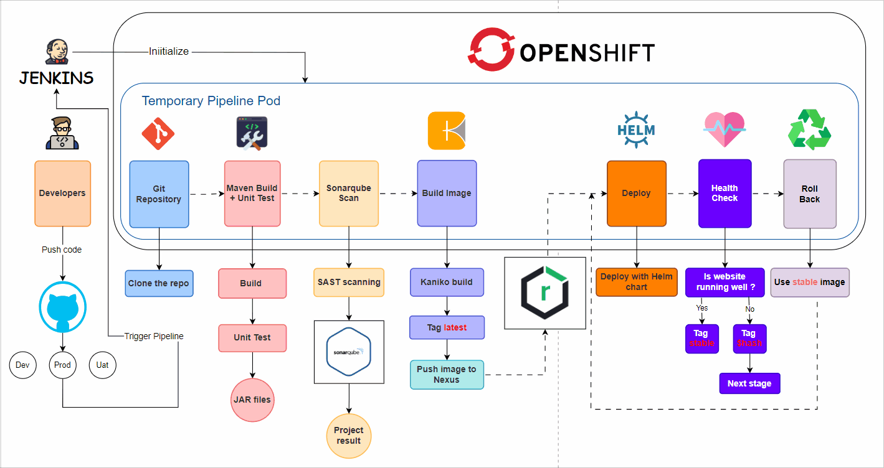

# Jenkins_pipeline-Maven-Nexus-Sonarqube-Docker
Using Jenkins pipeline to deploy Maven Web Application (written in Scripted format). Integrated with Nexus, Sonarqube and Docker

## Main Pipeline

    

## Description

### TechStack

- **Sonarqube**: SAST source code scanning
- **Kaniko**: For building images and uploading to **Nexus** repositories.
- **Helm**: Use Helm chart to deploy web application.

### Convention
Image:
- `stable`: Stable version of well-health app
- `latest`: Build with newest code, may not work correctly
- `$hash ($githash + 'DDMMYYYY')`: Build with version 'X' pushed by `$githash`, may not work correctly

Environment
- Production: Full pipeline
- Uat: Full pipeline
- Dev: First 4 stages

